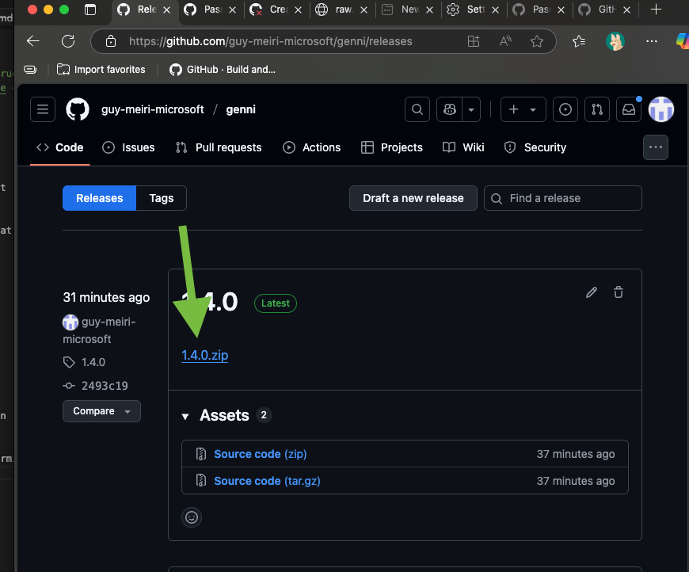
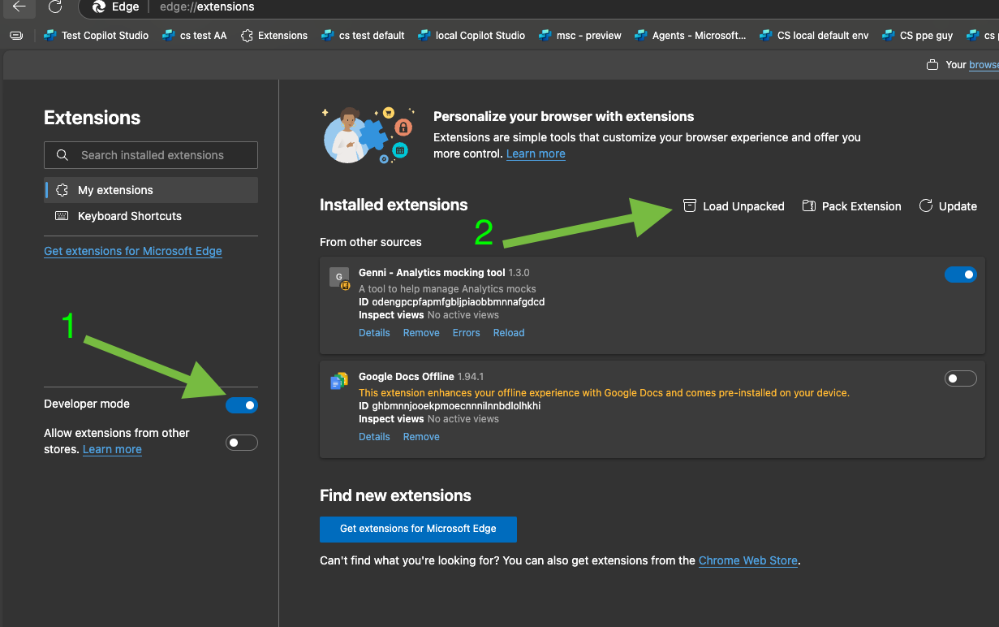
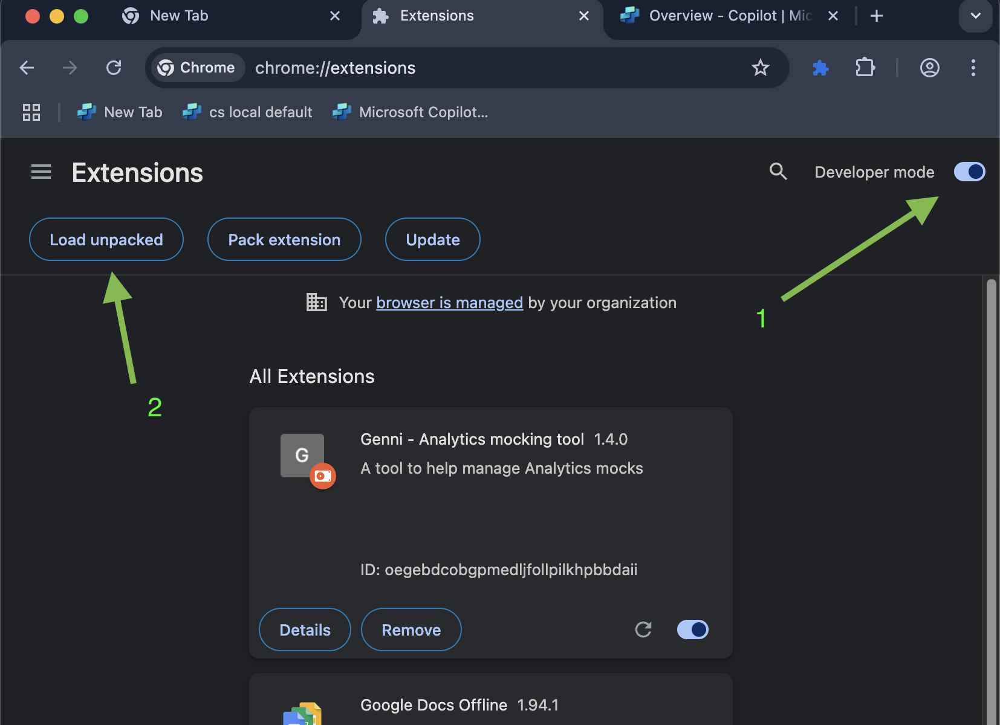

# Genni - Analytics Mocking Tool

A browser extension for managing analytics mocks in **Microsoft Copilot Studio**. This tool helps developers easily view, edit, and manage mock data stored in localStorage during development and testing.

## 🚀 Installation

### Step 1: Download the Latest Release

1. Go to the [Releases page](https://github.com/guy-meiri-microsoft/genni/releases)
2. Download the latest `x.x.x.zip` file

### Step 2: Extract the ZIP File

1. Extract the downloaded ZIP file to a folder on your computer
2. Remember the location of this folder

### Step 3: Install in Your Browser

#### For Microsoft Edge:
1. Open Edge and go to `edge://extensions/`
2. Turn on **Developer mode** (toggle in the left sidebar)
3. Click **Load unpacked**
4. Select the extracted folder from Step 2
5. The Genni extension should now appear in your extensions list

#### For Google Chrome:
1. Open Chrome and go to `chrome://extensions/`
2. Turn on **Developer mode** (toggle in the top right)
3. Click **Load unpacked**
4. Select the extracted folder from Step 2
5. The Genni extension should now appear in your extensions list

## 🎯 Usage

1. Navigate to your Microsoft Copilot Studio environment
2. Click the Genni extension icon in your browser toolbar
3. View and edit your analytics mock data
4. Changes are saved directly to localStorage

## 🔧 Features

- **View Mock Data**: See all analytics mocks for your current environment/bot
- **Edit JSON**: Built-in editor with validation and formatting
- **Environment Filtering**: Automatically shows relevant mocks based on your current page
- **Mock Toggle**: Enable/disable mocks with a single click
- **Version Checking**: Get notified when updates are available

## 📞 Support

If you encounter any issues:
1. Check that you're on a Microsoft Copilot Studio page
2. Ensure the extension has proper permissions
3. Try refreshing the page and reopening the extension
4. contact guymeiri@microsoft.com for further support